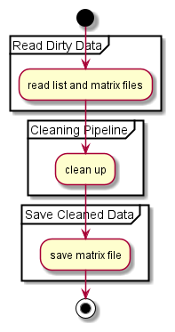

## CI-Actions

    
     

<h1 align="center">Sci-Fi-Pi<h2>
<h2 align="center">The Scientific Filtering Pipeline to Clean your Machine Learning Datasets<h2>

## Erkenntnisse zu den Datenset
- Dateien mit gleichem Namen haben gleichen Inhalt
- Beispieldaten sind künstlich erzeugt und beinhalten immer nur "ein" Problem.

Folgende 

- Physical Units (K <> C°)
- Formats (liste statt matrix)
- Lagging (Leicht versetzte Werte)
- base, [TS,Value] mit lücken (null or empty)
- flag, [TS,Value,QualityFlag] (wert mit einem Error flag in der dritten spalte)
- replacement [TS, Value] (Value hat Ersatzwert (UINT max))
- Rauschen
- Zeitzonen test

## Teamaufteilung

Gian / Artan : Lag
Michelle / Andreas : NA
Tom / Aljosha : Noise, Classification, 

## Abstract Architecture

